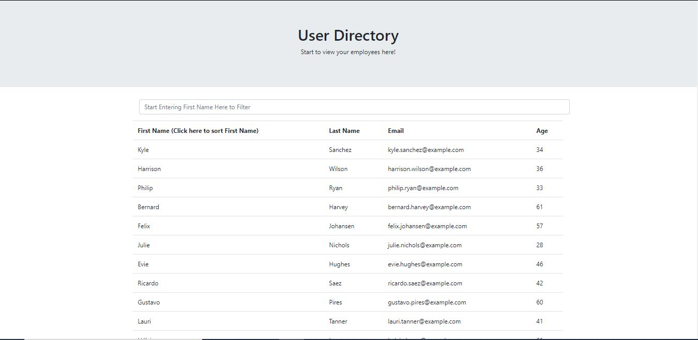

 # User Directory


## Description
This application allows employees quick access to their entire employee directory. An employee or manager would benefit greatly from being able to view non-sensitive data about other employees. It would be particularly helpful to be able to filter employees by name, email or age.

## Table of Contents
* [Installation](#Installation)
* [Demonstration](#Demonstration)
* [Technologies Used](#Technologies-Used)
* [Packages Used](#Technologies-Used)
* [My Learnings](#My-Learnings)


## Installation

```
$ git clone https://github.com/junkoyama/User-Directory.git

$ npm install

$ npm start
```
## Demonstration
### [Click Here for App's Deployed Link on Heroku](https://junko-user-directory.herokuapp.com/)
</br>


### Demo Screenshot


## Technologies Used
* React
* React Bootstrap
## Packages Used

```javascript
"dependencies": {
    "bootstrap": "^4.6.0",
    "react": "^17.0.1",
    "react-bootstrap": "^1.5.2",
    "react-dom": "^17.0.1",
    "react-scripts": "4.0.3",
  }
```

## My Learnings

:white_check_mark: Breaking up the UI into components
</br>
:white_check_mark: React Bootstrap
</br>
:white_check_mark: Managing Component States


[Return to Top](#User-Directory)